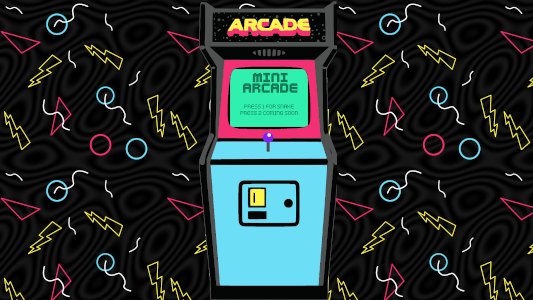

# mini-arcade

## About

Mini Arcade is a tiny video game arcade experiance with retro fun. This project was designed to be expanded on and one of the goals of the code base was to be able to make it easy to add more games. The arcade machine currently features Snake with plans for more choices coming in the future. 

OvercastGames is 
- Justin Asuncion-Esmena
- Kirk Garrison
- Ben Mills
- Kevin Stone

## Planning

- [Wire-frame](img/mini-arcade.png)
- [FlowChart/domain modeling](img/domainmodeling.png)
- [User stories and to-do lists](https://github.com/OvercastGames/mini-arcade/projects/2)

## Resources

- [Spicy Yoghurt HTML5 Game Development Tutorial](https://spicyyoghurt.com/tutorials/html5-javascript-game-development/develop-a-html5-javascript-game)
- [Arcade cabinet image - edited](https://www.clipartmax.com/middle/m2H7Z5b1Z5G6N4A0_video-game-clipart-retro-video-game-clipart-retro/)
- [Kenney Fonts](https://www.kenney.nl/)
- [Canri Games assets - sounds](https://canarigames.itch.io/canaripack-1bit-topdown)
- [Ion Emil Negoita's CSS Codepen for Logo Styling](https://codepen.io/inegoita/pen/BXyMvm)

